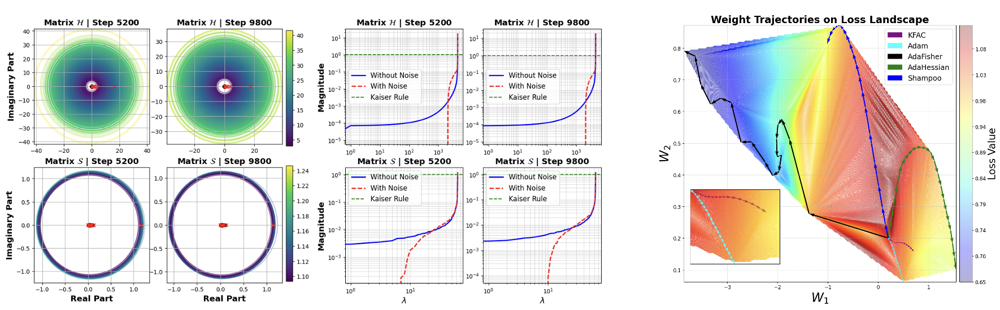

# AdaFisher: Adaptive Second Order Optimization via Fisher Information -- ICLR 2025

Abstract, _First-order optimization methods are currently the mainstream in training deep neural networks (DNNs). Optimizers like Adam incorporate limited curvature information by employing the diagonal matrix preconditioning of the stochastic gradient during the training. Despite their widespread, second-order optimization algorithms exhibit superior convergence properties compared to their first-order counterparts e.g. Adam and SGD. However, their practicality in training DNNs are still limited due to increased per-iteration computations and suboptimal accuracy compared to the first order methods. We present AdaFisher--an adaptive second-order optimizer that leverages a block-diagonal approximation to the Fisher information matrix for adaptive gradient preconditioning. AdaFisher aims to bridge the gap between enhanced convergence capabilities and computational efficiency in second-order optimization framework for training DNNs. Despite the slow pace of second-order optimizers, we showcase that AdaFisher can be reliably adopted for image classification, language modelling and stand out for its stability and robustness in hyperparameter tuning. We demonstrate that AdaFisher outperforms the SOTA optimizers in terms of both accuracy and convergence speed._ 

<center>
<a href="https://openreview.net/forum?id=puTxuiK2qO&noteId=EljVWMabSb" target="_blank">
    
</a>
<a href="https://arxiv.org/abs/2405.16397" target="_blank">
    
<div>
    <a href="https://damien3008.github.io" target="_blank">Damien Martins Gomes</a><sup>1,2</sup>,</span>
    <a href="https://sites.google.com/view/yanleizhang/home" target="_blank">Yanley Zhang</a><sup>3,4</sup>, </span>
    <a href="https://eugenium.github.io" target="_blank">Eugene Belilovsky</a><sup>1,3</sup>,</span>
    <a href="http://guywolf.org" target="_blank">Guy Wolf</a><sup>3,4</sup>,</span>
    <a href="https://atlasanalyticslab.ai" target="_blank">Mahdi S. Hosseini</a><sup>1,3</sup></span>
</div>
<div>
    <sup>1</sup>Concordia University&emsp;
    <sup>2</sup>IPSA Toulouse&emsp;
    <sup>3</sup>Mila&emsp;
    <sup>4</sup>Université de Montréal&emsp;
</div>
</center>
<center>
    
</center>


## 📁 Repository Contents

- [Enhanced Kronecker Factor Analysis and Optimizer Trajectory Visualization on Loss Landscapes](#💡-enhanced-kronecker-factor-analysis-and-optimizer-trajectory-visualization-on-loss-landscapes)
- [Image Classification](#️🖼️-image-classification)
    - [Usage](#🎯-usage)
    - [Integrating AdaFisher/AdaFisherW as an Optimizer](#🔗-integrating-adafisheradafisherw-as-an-optimizer)
    - [Training with Pretrained Weights](#🌎-training-with-pretrained-weights)
- [Language Modeling](#📖-language-modeling)
    - [Dataset Download](#dataset-download)
    - [Usage](#🎯-usage-1)
- [Distributed Training](#⚡️-distributed-training)
- [Getting Started](#🌟-getting-started)
    - [Prerequisites](#prerequisites)
    - [Using pip](#using-pip)
    - [Using Conda](#using-conda)
- [License](#📜-license)
- [Citation](#📄-citation)


## 💡 Enhanced Kronecker Factor Analysis and Optimizer Trajectory Visualization on Loss Landscapes
**Overview:** We analyzed the Kronecker factors $\mathcal{H}$ and $\mathcal{S}$, revealing that their energy primarily concentrates along the diagonal. Key findings include:
- **Gershgorin Circle Theorem**: Used to estimate eigenvalue bounds, providing insights into layer conditioning and stability during training.
- **Eigenvalue perturbation**: Adding noise to off-diagonal elements showed that eigenvalues above the Kaiser rule remain unchanged, highlighting the diagonal dominance.
- **Frequency Field Analysis**: Leveraged FFT to identify dominant frequency patterns in Kronecker factors, shedding light on learning dynamics and feature extraction.

We also develop a new technique that visualizes trajectories across different optimizers for better understanding of model behavior in the loss landscape (please refer to `Visualization_Loss_Landscape.ipynb`)

<center>
    
</center>


## 🖼️ Image Classification 
This repository provides all necessary code to employ AdaFisher and compare it with other leading SOTA optimizers. It is structured based on the RMSGD framework (paper branch). For additional details, refer to the [RMSGD project](https://github.com/mahdihosseini/RMSGD/tree/paper).

### 🎯 Usage

To facilitate replication of our experimental results, we include multiple configuration files within the [configs](Image_Classification/configs) directory. To run a training session using these configurations, execute the following command:

```console
python train.py --config config.yaml
```
For a list of available command-line options, you can run:
```console
python train.py --help
```
### 🔗 Integrating AdaFisher/AdaFisherW as an Optimizer
AdaFisher and AdaFisherW can be seamlessly integrated into your training pipeline like any standard optimizer. Here’s how to set it up with your model:
```python
from AdaFisher import AdaFisher, AdaFisherW 
...
optimizer = AdaFisher(network, ...) # AdaFisherW(network, ...) 
...
for input in data_loader:
    optimizer.zero_grad()
    output = network(input)
    optimizer.step()
```
**Important**: When initializing AdaFisher, pass the entire network object to the optimizer, not just its parameters. This ensures that the optimizer has full context of the model architecture, which is essential for leveraging the Fisher Information effectively. Please ensure to avoid using in-place operations in the model. For instance:

```python
# Instead of using in-place addition:
out = layer1
out = out + layer5  # Correct way
# Avoid this:
# out += layer5

# Instead of using in-place ReLU:
relu = ReLU(inplace=False)  # Correct way
# Avoid this:
# relu = ReLU(inplace=True)
```

### 🌎 Training with Pretrained Weights
To train using pretrained weights, utilize the following command:
```console
python train.py --config config.yaml --pretrained
```
This allows the several optimizers to leverage previously learned weights, potentially improving convergence speed and final model accuracy for complex image classification tasks.

## 📖 Language Modeling 

This section of the repository focuses on training various optimizers using the WikiText-2 dataset with a compact GPT-1 network.

### Dataset Download

The dataset for this project is hosted on Google Drive. You can download it using the following link: [Download Dataset](https://drive.google.com/file/d/1Yl-AuSZe15MLes3iA4o4Ryz9zbmcapfC/view?usp=share_link)

### 🎯 Usage

To replicate our experimental results accurately, we provide a series of executable bash scripts in the [Language_Model](Language_Model) directory. These scripts are pre-configured with all necessary settings to facilitate straightforward experimentation. 

For detailed information on all available command-line options, execute the following command:

```console
python train.py --help
```

## ⚡️ Distributed Training

AdaFisher is fully compatible with multi-GPU environments through its distributed version. To enable this functionality, ensure that the **dist** parameter in the AdaFisher YAML configuration file is set to True when using a distributed environment.

## 🌟 Getting Started 

### Prerequisites
To set up the required environment, you can either use `pip` or `conda`.

### Using pip
You can install all required packages using:
```bash
pip install -r requirements.txt
pip install notebook
```
With a Python version of 3.9 or later.

### Using Conda
First, create a new Conda environment with Python:
```bash
conda create -n AdaFisher python
```
Activate the environment:
```bash
conda activate AdaFisher
```
Then, install the required packages from the requirements.txt file:
```bash
pip install -r requirements.txt
conda install -n AdaFisher ipykernel --update-deps --force-reinstall
```

## 📜 License

This project is licensed under the [GNU General Public License v3.0](https://www.gnu.org/licenses/gpl-3.0.en.html) - see the [LICENSE](LICENSE) file for details.

## 📄 Citation
If you find this repository useful, please consider giving a star ⭐ and citing our work 📝:)

```bibtex
@misc{gomes2024adafisher,
      title={AdaFisher: Adaptive Second Order Optimization via Fisher Information}, 
      author={Damien Martins Gomes and Yanlei Zhang and Eugene Belilovsky and Guy Wolf and Mahdi S. Hosseini},
      year={2024},
      eprint={2405.16397},
      archivePrefix={arXiv},
      primaryClass={cs.LG}
}
```