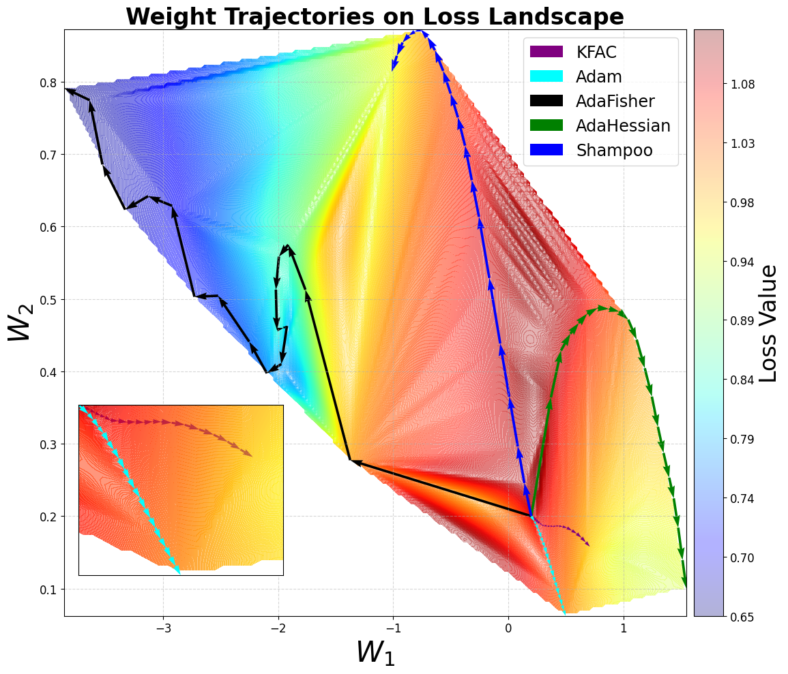

# AdaFisher: Adaptive Second Order Optimization via Fisher Information

Abstract, _First-order optimization methods are currently the mainstream in training deep neural networks (DNNs). Optimizers like Adam incorporate limited curvature information by employing the diagonal matrix preconditioning of the stochastic gradient during the training. Despite their widespread, second-order optimization algorithms exhibit superior convergence properties compared to their first-order counterparts e.g. Adam and SGD. However, their practicality in training DNNs are still limited due to increased per-iteration computations and suboptimal accuracy compared to the first order methods. We present AdaFisher--an adaptive second-order optimizer that leverages a block-diagonal approximation to the Fisher information matrix for adaptive gradient preconditioning. AdaFisher aims to bridge the gap between enhanced convergence capabilities and computational efficiency in second-order optimization framework for training DNNs. Despite the slow pace of second-order optimizers, we showcase that AdaFisher can be reliably adopted for image classification, language modelling and stand out for its stability and robustness in hyperparameter tuning. We demonstrate that AdaFisher outperforms the SOTA optimizers in terms of both accuracy and convergence speed._ 

[[arXiv]](https://arxiv.org/abs/2405.16397) | [[Citation]](#Citation)
<center>
    
</center>

## 📁 Repository Contents
This project is organized into four main folders, each dedicated to a specific aspect of our research and development efforts.

### 🛠️ Optimizers

This section features the implementation of a variety of optimizers, including both well-established methods and novel optimizers developed during our research. Explore the optimizers in the [optimizers](optimizers) directory:

- **`AdaFisher`**: An optimizer developed as part of our research, focusing on second-order optimization techniques by integrating Fisher Information.
- **`AdaFisherW`**: A variant of AdaFisher, based on the AdamW framework, incorporating second-order optimization techniques through Fisher Information.
- **`KFAC`**: An optimizer that leverages second-order optimization techniques via Fisher Information. For more details, visit the [KFAC-Pytorch](https://github.com/alecwangcq/KFAC-Pytorch) repository.
- **`SGD`**: The standard Stochastic Gradient Descent optimizer. For further information, refer to the [ASDL](https://github.com/kazukiosawa/asdl) repository.
- **`AdaHessian`**: An optimizer that uses Hessian-based information to adjust learning rates. Additional information can be found in the [AdaHessian](https://github.com/amirgholami/adahessian) repository.
- **`Adam`**: The Adaptive Moment Estimation optimizer, renowned for its effectiveness in various deep learning tasks.
- **`AdamW`**: A variant of the Adam optimizer that includes weight decay for better regularization, widely used for its enhanced performance in deep learning tasks.


### 💡 Enhanced Kronecker Factor Analysis and Optimizer Trajectory Visualization on Loss Landscapes
<center>
    
</center>

---

This repository is dedicated to analyzing the structure of Kronecker factors within ResNet18 architectures, using the CIFAR-10 dataset, and visualizing the loss landscape and trajectories of various optimizers. It showcases innovative optimization techniques, including a novel optimizer named AdaFisher, and provides detailed insights into the dynamics of deep learning model training.

#### 📂 Structure 

- **`models/`**: Contains the implementation of the ResNet18 network.

#### 📓 Jupyter Notebooks 

- **`Kronecker_Factors_Analysis.ipynb`**: This notebook delves into the properties of Kronecker factors across various layers of a neural network using the ResNet18 model, specifically applied to the CIFAR-10 dataset. Key aspects of the analysis include:
    - **Gershgorin Circle Theorem**: Utilizes this theorem to estimate the eigenvalue bounds of Kronecker-factored approximations. This is critical for understanding the conditioning of layers and their stability during training.
    - **Frequency Field**: Examines the distribution of frequency components (FFT) in the Kronecker factors, which helps in identifying the dominant frequency patterns that influence learning dynamics and feature extraction capabilities of the network layers.
- **`Visualization_Kronecker_Factors.ipynb`**: Provides visualizations of Kronecker factors to better understand their structures and behavior across training.
- **`Visualization_Loss_Landscape.ipynb`**: Offers a visual exploration of the loss landscape and trajectories of various optimizers, crucial for understanding optimization paths and strategies.
- **`train.ipynb`**: Contains the training loops for the ResNet18 model using the different optimizers, including performance comparisons and analysis.

### 🖼️ Image Classification 
This repository provides all necessary code to employ AdaFisher and compare it with other leading SOTA optimizers. It is structured based on the RMSGD framework (paper branch). For additional details, refer to the [RMSGD project](https://github.com/mahdihosseini/RMSGD/tree/paper).

#### 🎯 Usage

To facilitate replication of our experimental results, we include multiple configuration files within the [configs](Image_Classification/configs) directory. To run a training session using these configurations, execute the following command:

```console
python train.py --config config.yaml
```
For a list of available command-line options, you can run:
```console
python train.py --help
```
##### 🔗 Integrating AdaFisher/AdaFisherW as an Optimizer
AdaFisher and AdaFisherW can be seamlessly integrated into your training pipeline like any standard optimizer. Here’s how to set it up with your model:
```python
from AdaFisher import AdaFisher, AdaFisherW 
...
optimizer = AdaFisher(network, ...) # AdaFisherW(network, ...) 
...
for input in data_loader:
    optimizer.zero_grad()
    output = network(input)
    optimizer.step()
```
**Important**: When initializing AdaFisher, pass the entire network object to the optimizer, not just its parameters. This ensures that the optimizer has full context of the model architecture, which is essential for leveraging the Fisher Information effectively. Please ensure to avoid using in-place operations in the model. For instance:

```python
# Instead of using in-place addition:
out = layer1
out = out + layer5  # Correct way
# Avoid this:
# out += layer5

# Instead of using in-place ReLU:
relu = ReLU(inplace=False)  # Correct way
# Avoid this:
# relu = ReLU(inplace=True)
```

#### 🌎 Training with Pretrained Weights
To train using pretrained weights, utilize the following command:
```console
python train.py --config config.yaml --pretrained
```
This allows the several optimizers to leverage previously learned weights, potentially improving convergence speed and final model accuracy for complex image classification tasks.

### 📖 Language Modeling 

This section of the repository focuses on training various optimizers using the WikiText-2 dataset with a compact GPT-1 network.

#### Dataset Download

The dataset for this project is hosted on Google Drive. You can download it using the following link: [Download Dataset](https://drive.google.com/file/d/1Yl-AuSZe15MLes3iA4o4Ryz9zbmcapfC/view?usp=share_link)

#### 🎯 Usage

To replicate our experimental results accurately, we provide a series of executable bash scripts in the [Language_Model](Language_Model) directory. These scripts are pre-configured with all necessary settings to facilitate straightforward experimentation. 

For detailed information on all available command-line options, execute the following command:

```console
python train.py --help
```
### Distributed Training ⚡️

AdaFisher is fully compatible with multi-GPU environments through its distributed version. To enable this functionality, ensure that the **dist** parameter in the AdaFisher YAML configuration file is set to True when using a distributed environment.

## 🌟 Getting Started 

### Prerequisites
To set up the required environment, you can either use `pip` or `conda`.

#### Using pip
You can install all required packages using:
```bash
pip install -r requirements.txt
pip install notebook
```
With a Python version of 3.9 or later.

#### Using Conda
First, create a new Conda environment with Python:
```bash
conda create -n AdaFisher python
```
Activate the environment:
```bash
conda activate AdaFisher
```
Then, install the required packages from the requirements.txt file:
```bash
pip install -r requirements.txt
conda install -n AdaFisher ipykernel --update-deps --force-reinstall
```

# License 📜

This project is licensed under the [GNU General Public License v3.0](https://www.gnu.org/licenses/gpl-3.0.en.html) - see the [LICENSE](LICENSE) file for details.

# Citation 📄

If you find this repository useful, please consider giving a star and citation (arxiv preprint):

```bibtex
@misc{gomes2024adafisher,
      title={AdaFisher: Adaptive Second Order Optimization via Fisher Information}, 
      author={Damien Martins Gomes and Yanlei Zhang and Eugene Belilovsky and Guy Wolf and Mahdi S. Hosseini},
      year={2024},
      eprint={2405.16397},
      archivePrefix={arXiv},
      primaryClass={cs.LG}
}
```